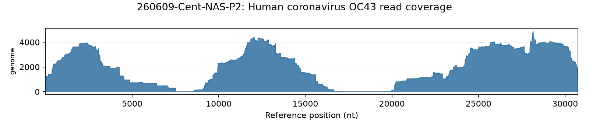
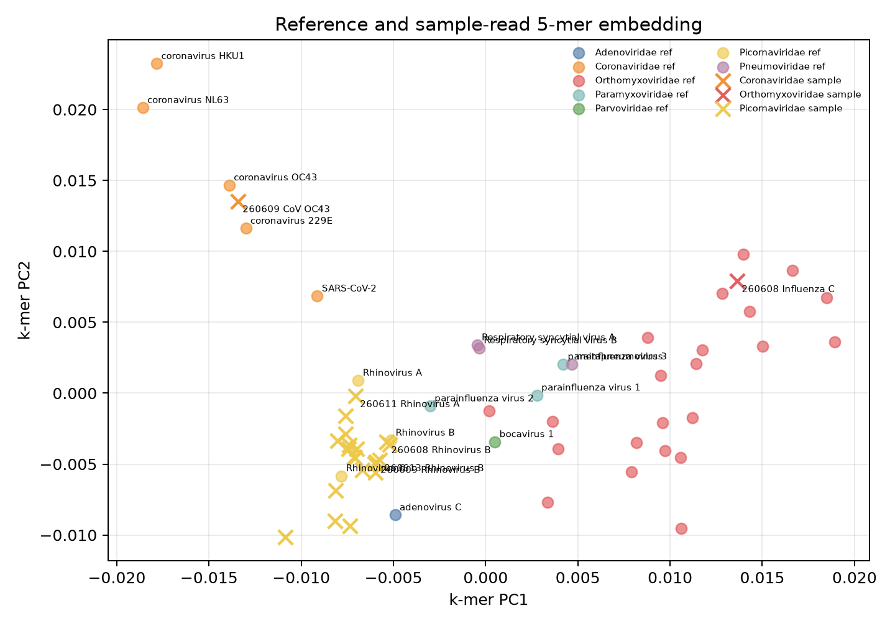

# Pivotal Biodefense Work Task - Metagenomic Biosurveillance

This repository contains a compact analysis for the Pivotal Biodefense Fellowship 2026 metagenomic biosurveillance work task.

## Contents

- `scripts/part2_taxonomic_classification.py` - downloads Zephyr respiratory viral reads, builds a common respiratory-virus reference panel, maps reads with minimap2, and summarizes virus calls plus genome coverage.
- `scripts/part3_kmer_clustering.py` - embeds reference sequences and sample-assigned read sets with normalized 5-mer composition, reduces dimensions with SVD, and clusters them with k-means.
- `results/` - summary CSV outputs used in the memo.
- `figures/` - coverage plots and k-mer clustering figures.
- `part2_deliverable.md` - memo-ready Part 2 result text.
- `part3_deliverable.md` - memo-ready Part 3B result text.
- `final_memo_draft.md` - concise Google Doc draft.

Large raw reads and alignment intermediates are intentionally not tracked in Git; they are regenerated by the scripts.

## Environment

Create the conda environment:

```bash
conda env create -f environment.yml
conda activate biodef
```

The scripts expect `minimap2` and the Python packages listed in `environment.yml`.

## Reproduce

Run Part 2:

```bash
MPLCONFIGDIR=.cache/matplotlib /Users/savely/miniforge3/envs/biodef/bin/python scripts/part2_taxonomic_classification.py
```

Run Part 3B:

```bash
MPLCONFIGDIR=.cache/matplotlib /Users/savely/miniforge3/envs/biodef/bin/python scripts/part3_kmer_clustering.py
```

## Key Outputs

Part 2:

- `results/virus_calls_by_sample.csv`
- `results/virus_summary_across_samples.csv`
- `results/coverage_by_reference_segment.csv`
- `results/coverage_figures.csv`
- `figures/coverage/`

Part 3B:

- `results/part3_combined_kmer_embeddings.csv`
- `results/part3_cluster_summary.csv`
- `results/part3_sample_reference_comparison.csv`
- `figures/part3_sample_reference_kmer_clusters.png`

**Additional sequence-clustering experiments using DNA/protein language models are available in this Google Colab notebook:** [Google Colab link](https://colab.research.google.com/drive/1WGsi3m0uF3NhYCoAmzq1_JIk4PSik5Rf#scrollTo=wfXfidpCNzD5).

## Report

### Part 2 - Taxonomic Classification

I analyzed 12 Zephyr respiratory-read swab pools from June 5-13, 2026, covering Boston Park/Tremont St, Copley Square, Central Square, MBTA Davis Square, and MBTA Harvard Station. I mapped the ONT respiratory viral reads against a curated panel of common respiratory-virus references using minimap2, kept the best viral alignment per read, and summarized read support, median alignment identity, genome coverage breadth, and mean depth per virus.

Confidence labels were assigned from read support, coverage, and median identity: high confidence required at least 50 reads, at least 20% reference coverage, and median identity at least 85%; medium confidence required at least 10 reads, at least 2% coverage, and median identity at least 75%; low confidence required at least 3 reads and median identity at least 70%; smaller calls were treated as very low confidence. These thresholds are conservative for rhinoviruses: many rhinovirus calls have thousands of reads and near-complete genome coverage, but only ~72-77% identity to the prototype reference, so I interpret them as strong evidence for rhinovirus-like viruses while being cautious about exact species assignment.

#### Main Findings

The dominant signal across the pools was rhinovirus. Rhinovirus A and B were detected in all 12 pools, often with broad genome coverage. Rhinovirus C was detected in 6 pools, but generally with less read support and lower coverage. I also detected two non-rhinovirus respiratory-virus signals with high confidence: Influenza C in 260608-Copl-NAS-P1 and Human coronavirus OC43 in 260609-Cent-NAS-P2. Human coronavirus NL63 appeared as a single-read, very-low-confidence signal and should not be treated as a robust positive.

No SARS-CoV-2, influenza A/B, RSV A/B, metapneumovirus, parainfluenza viruses, adenovirus C, or bocavirus 1 were called in these pools under this reference-panel mapping approach.

#### Virus Summary Across Pools

| Virus | Positive pools | Total assigned reads | Max reads in one pool | Median identity | Max coverage breadth | Median coverage breadth |
|---|---:|---:|---:|---:|---:|---:|
| Rhinovirus A | 12 | 170,550 | 89,662 | 72.5% | 100.0% | 97.3% |
| Rhinovirus B | 12 | 62,681 | 30,881 | 74.8% | 100.0% | 88.8% |
| Human coronavirus OC43 | 6 | 20,394 | 20,386 | 97.2% | 88.6% | 16.7% |
| Rhinovirus C | 6 | 677 | 329 | 73.2% | 63.5% | 25.7% |
| Influenza C | 1 | 413 | 413 | 96.0% | 85.8% | 85.8% |
| Human coronavirus NL63 | 1 | 1 | 1 | 98.1% | 4.6% | 4.6% |

#### Per-Pool Calls

| Sample | Location/date | Main calls |
|---|---|---|
| 260605-BC-NAS-P2 | Boston Park/Tremont, Jun 5 | Rhinovirus A: 5,116 reads, 100.0% coverage, low exact-reference confidence; Rhinovirus B: 5 reads, 84.7% coverage, low; OC43 and Rhinovirus C: single-read very-low calls |
| 260605-BC-NAS-P3 | Boston Park/Tremont, Jun 5 | Rhinovirus A: 6,561 reads, 100.0% coverage, low exact-reference confidence; Rhinovirus B: 2 reads, very low |
| 260608-Copl-NAS-P1 | Copley Square, Jun 8 | Rhinovirus A: 89,662 reads, 100.0% coverage, low exact-reference confidence; Rhinovirus B: 4,999 reads, 100.0% coverage, medium; Influenza C: 413 reads, 85.8% aggregate coverage, high; Rhinovirus C: 329 reads, 63.5% coverage, low |
| 260608-Copl-NAS-P2 | Copley Square, Jun 8 | Rhinovirus A: 83 reads, 88.3% coverage, low; Rhinovirus B: 7 reads, 41.5% coverage, low |
| 260609-Cent-NAS-P1 | Central Square, Jun 9 | Rhinovirus B: 5,465 reads, 96.8% coverage, medium; Rhinovirus A: 2,814 reads, 87.1% coverage, low exact-reference confidence; HCoV NL63: single-read very-low call |
| 260609-Cent-NAS-P2 | Central Square, Jun 9 | Human coronavirus OC43: 20,386 reads, 88.6% coverage, high; Rhinovirus B: 1,554 reads, 98.6% coverage, low exact-reference confidence; Rhinovirus A: 256 reads, 98.5% coverage, low |
| 260610-MBTA_Da-NAS-P1 | MBTA Davis, Jun 10 | Rhinovirus A: 30,366 reads, 100.0% coverage, low exact-reference confidence; Rhinovirus B: 764 reads, 92.9% coverage, low; Rhinovirus C: 55 reads, 63.5% coverage, low; OC43: single-read very-low call |
| 260610-MBTA_Da-NAS-P2 | MBTA Davis, Jun 10 | Only very-low calls: OC43, Rhinovirus A, and Rhinovirus B, with 2 reads each |
| 260611-BC-NAS-P1 | Boston Park/Tremont, Jun 11 | Rhinovirus A: 1,050 reads, 97.6% coverage, medium; Rhinovirus C: 257 reads, 42.3% coverage, low; Rhinovirus B: 21 reads, 33.4% coverage, medium; OC43: 3 reads, low |
| 260611-BC-NAS-P2 | Boston Park/Tremont, Jun 11 | Rhinovirus B: 30,881 reads, 98.7% coverage, low exact-reference confidence; Rhinovirus A: 20,907 reads, 95.2% coverage, low; Rhinovirus C: 19 reads, 9.1% coverage, low |
| 260611-BC-NAS-P3 | Boston Park/Tremont, Jun 11 | Rhinovirus A: 12,611 reads, 97.0% coverage, low exact-reference confidence; Rhinovirus B: 17 reads, 55.6% coverage, low; Rhinovirus C: 16 reads, 5.7% coverage, medium |
| 260613-MBTA_Ha-NAS-P1 | MBTA Harvard, Jun 13 | Rhinovirus B: 18,964 reads, 96.4% coverage, medium; Rhinovirus A: 1,122 reads, 72.5% coverage, low; OC43: single-read very-low call |

#### Genome Coverage

Rhinovirus A showed broad coverage in nearly every pool, reaching complete reference coverage in four samples and near-complete coverage in many others. Rhinovirus B also showed broad coverage, including complete coverage in 260608-Copl-NAS-P1 and 98-99% coverage in 260609-Cent-NAS-P1, 260609-Cent-NAS-P2, 260611-BC-NAS-P2, and 260613-MBTA_Ha-NAS-P1. Rhinovirus C was weaker: the best-supported pools reached 63.5% breadth, but most calls were much lower.

The clearest non-rhinovirus calls were Influenza C and HCoV OC43. Influenza C in 260608-Copl-NAS-P1 had high median identity and broad segment coverage: PB2 86.8%, PB1 87.9%, P3 90.7%, HEF 97.7%, NP 91.3%, and MP 41.3%. HCoV OC43 in 260609-Cent-NAS-P2 covered 27,247 of 30,741 reference bases, or 88.6%, with high depth. Other OC43 calls were supported by only 1-3 reads and are best treated as very-low or low-confidence background signals rather than robust positives.



**Figure 1.** Genome coverage for the high-confidence HCoV OC43 call in sample 260609-Cent-NAS-P2. Reads covered 27,247 / 30,741 reference bases (88.6% breadth), with 20,386 assigned reads and high median identity, supporting a robust OC43 detection in this pool.

The full result tables are in `results/virus_calls_by_sample.csv`, `results/virus_summary_across_samples.csv`, and `results/coverage_by_reference_segment.csv`; coverage plots are listed in `results/coverage_figures.csv` and stored under `figures/coverage/`.

### Part 3B - Embedding-Based Clustering

For the optional coding track, I chose embedding-based clustering. I used a lightweight nucleotide-composition approach rather than downloading a large sequence model. Each reference sequence and each sample-virus read set was represented as a normalized 5-mer frequency vector. I then centered the matrix, projected it into six dimensions with SVD, and clustered the embedded points with k-means using seven clusters. Sample-virus read sets were included when the Part 2 classifier assigned at least 25 reads to that virus in that sample.

This analysis embedded 38 respiratory-virus reference records and 22 sample-virus read sets. The reference panel included common respiratory-virus genomes or segments across Coronaviridae, Picornaviridae, Orthomyxoviridae, Pneumoviridae, Paramyxoviridae, Adenoviridae, and Parvoviridae. The sample read sets came from the Part 2 calls, mainly rhinoviruses plus one Influenza C and one HCoV OC43 high-confidence signal.

#### Results

The clustering agreed well with the broad taxonomy profile. The weighted family purity across clusters was 0.917. For sample read sets, the nearest-reference family match rate was 1.000: every sample read set had its nearest reference in the expected viral family. The exact-virus match rate was lower, 0.455, mostly because many rhinovirus A/B/C sample read sets were nearest to another rhinovirus reference rather than the exact assigned rhinovirus species.

The main sample-containing clusters were:

| Cluster | Records | References | Sample read sets | Main family | Family purity | Interpretation |
|---:|---:|---:|---:|---|---:|---|
| 2 | 24 | 4 | 20 | Picornaviridae | 95.8% | Contains all rhinovirus sample read sets and the rhinovirus references; this supports the Part 2 rhinovirus calls at family/genus level. |
| 4 | 9 | 8 | 1 | Orthomyxoviridae | 100.0% | Contains the Influenza C sample read set from 260608-Copl-NAS-P1 near Influenza C references. |
| 6 | 6 | 5 | 1 | Coronaviridae | 100.0% | Contains the HCoV OC43 sample read set from 260609-Cent-NAS-P2 near coronavirus references. |

The remaining clusters contained references only. Influenza references split across several clusters, which is expected because the reference panel contains multiple segmented influenza records rather than one genome-length record per virus. Pneumoviridae and Paramyxoviridae grouped together in one reference-only cluster, suggesting that this simple 5-mer/SVD approach captures broad sequence-composition structure but does not perfectly separate every respiratory-virus family.

#### Comparison to Taxonomic Profile

The embedding results support the main Part 2 conclusions. The high-confidence Influenza C call in 260608-Copl-NAS-P1 clustered with Orthomyxoviridae and had Influenza C as its nearest reference. The high-confidence HCoV OC43 call in 260609-Cent-NAS-P2 clustered with Coronaviridae and had HCoV OC43 as its nearest reference. The rhinovirus calls all clustered in the Picornaviridae/rhinovirus region, consistent with the strong read-count and coverage evidence in Part 2.

Exact rhinovirus species agreement was weaker. Many sample read sets assigned as Rhinovirus A had Rhinovirus B or C as the nearest reference in 5-mer space, and some Rhinovirus B calls were nearest to Rhinovirus C. I interpret this as a limitation of the simple composition embedding, not as evidence against rhinovirus presence. The Part 2 mappings already showed that many rhinovirus calls had broad genome coverage but relatively low identity to prototype references, so family/genus-level agreement is the more appropriate readout here.



**Figure 2.** 5-mer/SVD embedding of respiratory-virus references and sample-derived read sets. Sample read sets cluster with the expected viral families: rhinovirus calls fall in the Picornaviridae cluster, the Influenza C sample falls with Orthomyxoviridae, and the HCoV OC43 sample falls with Coronaviridae. This supports the Part 2 calls at family level, while exact rhinovirus species separation remains weaker.

#### Limitations

This is a deliberately lightweight clustering analysis. Normalized 5-mer composition ignores alignment, gene order, and evolutionary substitution models, and it can be affected by read length, coverage bias, and ONT error profiles. The reference panel is also small and uses prototype references, which limits exact species resolution for diverse rhinoviruses. A stronger follow-up would compare assembled contigs or higher-confidence ORFs against a broader reference set and add ANI or phylogenetic analysis. For this work task, the embedding provides an independent sanity check that the sample read sets occupy the expected viral-family neighborhoods.

The full outputs are in `results/part3_combined_kmer_embeddings.csv`, `results/part3_cluster_summary.csv`, and `results/part3_sample_reference_comparison.csv`.
